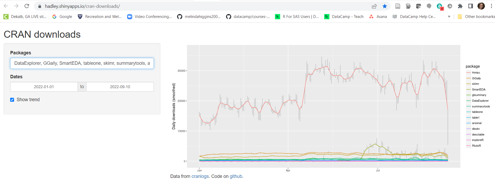
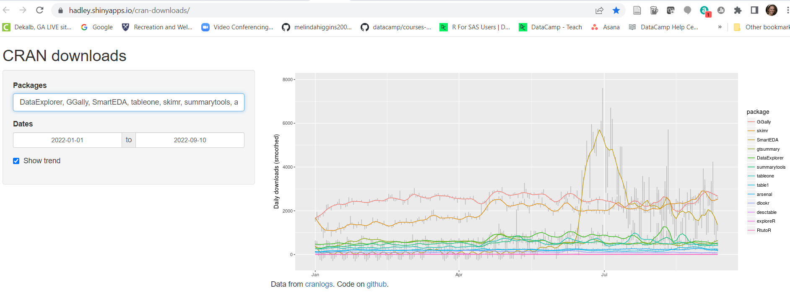

## A Very Brief Intro to EDA and Summary Table Packages

FYI: EDA = exploratory data analysis

```{r setup, include=FALSE}
knitr::opts_chunk$set(echo = TRUE)
knitr::opts_chunk$set(error = TRUE)
knitr::opts_chunk$set(message = FALSE)
knitr::opts_chunk$set(warning = FALSE)
```

## `skimr` package - main use of `skim()` function

* learn more at [https://docs.ropensci.org/skimr/](https://docs.ropensci.org/skimr/)
* side note - the tiny histograms included in the summary statistics table only shows up in HTML and DOC. 
* The default settings for knitting to PDF will not work. You need to change the LaTeX engine to xelatex using these options in the YAML header:

```
output:
  pdf_document:
    latex_engine: xelatex
```

```{r}
# skimr
library(skimr)
skim(mtcars)
```

### `skimr` - use with `dplyr`

```{r}
# use with dplyr, pipes and group_by()
library(dplyr)
mtcars %>%
  dplyr::group_by(cyl) %>%
  skim()
```

## `Summarytools` package

* learn more at [https://cran.r-project.org/web/packages/summarytools/vignettes/introduction.html](https://cran.r-project.org/web/packages/summarytools/vignettes/introduction.html)

### Simple frequency tables - 1 categorical variable

**NOTE**: For the tables generated from the summarytools functions, you need to add `results = 'asis'` as a chunk option.

```{r results = 'asis'}
library(summarytools)
freq(mtcars$cyl, 
     plain.ascii = FALSE, 
     style = "rmarkdown")
```

### Crosstables - 2 categorical variables

```{r results='asis'}
mtcars$cyl.f <- as.factor(mtcars$cyl)
mtcars$am.f <- factor(mtcars$am,
                      levels = c(0, 1),
                      labels = c("automatic","manual"))
ctable(x = mtcars$cyl.f,
       y = mtcars$am.f,
       prop = "c")
```

### Descriptive Stats with `summarytools::descr()`

```{r results = 'asis'}
library(dplyr)
mtcars %>%
  select(mpg, cyl, disp, hp) %>%
  summarytools::descr()

st_options(descr.stats = "common")

mtcars %>%
  select(mpg, cyl, disp, hp) %>%
  summarytools::descr()
```

## Also try `arsenal` package

When using these functions you also need to put `results = 'asis'` as a chunk option so the tables "knit" correctly.

Learn more about the `arsenal` package at:

* [https://mayoverse.github.io/arsenal/](https://mayoverse.github.io/arsenal/)
* the "workhorse" function is `tableby()`, see [https://mayoverse.github.io/arsenal/articles/tableby.html](https://mayoverse.github.io/arsenal/articles/tableby.html)

### Create a "tableby" object (`tab1`) and then run the `summary(tab1)` on that object.

```{r results = 'asis'}
library(arsenal)
tab1 <- 
  tableby(~ mpg + disp + hp, data=mtcars)
summary(tab1)
```

### Add a grouping variable

```{r results = 'asis'}
tab1 <- 
  tableby(cyl ~ mpg + disp + hp, data=mtcars)
summary(tab1)
```

## More to read on R packages for EDA and Summary Tables

see [https://towardsdatascience.com/four-r-packages-for-automated-exploratory-data-analysis-you-might-have-missed-c38b03d4ee16](https://towardsdatascience.com/four-r-packages-for-automated-exploratory-data-analysis-you-might-have-missed-c38b03d4ee16)

* `DataExplorer`
* `GGally`
* `SmartEDA`
* `tableone`

others...

* `skimr`
* `summarytools`
* `arsenal`
* `gtsummary`
* `dlookr`
* `Hmisc`
* `exploreR`
* `RtutoR`
* `desctable`
* `arsenal`
* `table1`

### Compare these packages - for exploratory data analysis and data summary tables

Go to [https://hadley.shinyapps.io/cran-downloads/](https://hadley.shinyapps.io/cran-downloads/) and type in the list of packages separated by a comma:

DataExplorer, GGally, SmartEDA, tableone, skimr, summarytools, arsenal, gtsummary, dlookr, Hmisc, exploreR, RtutoR, desctable, arsenal, table1

Chart from Jan 2022 to Sept 11, 2022



Chart from Jan 2022 to Sept 11, 2022 - without `Hmisc`



